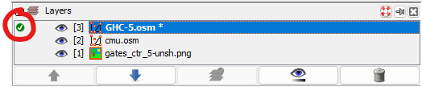
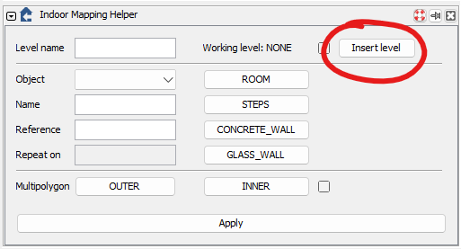
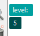
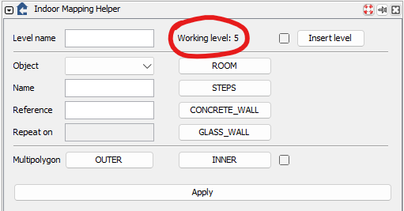
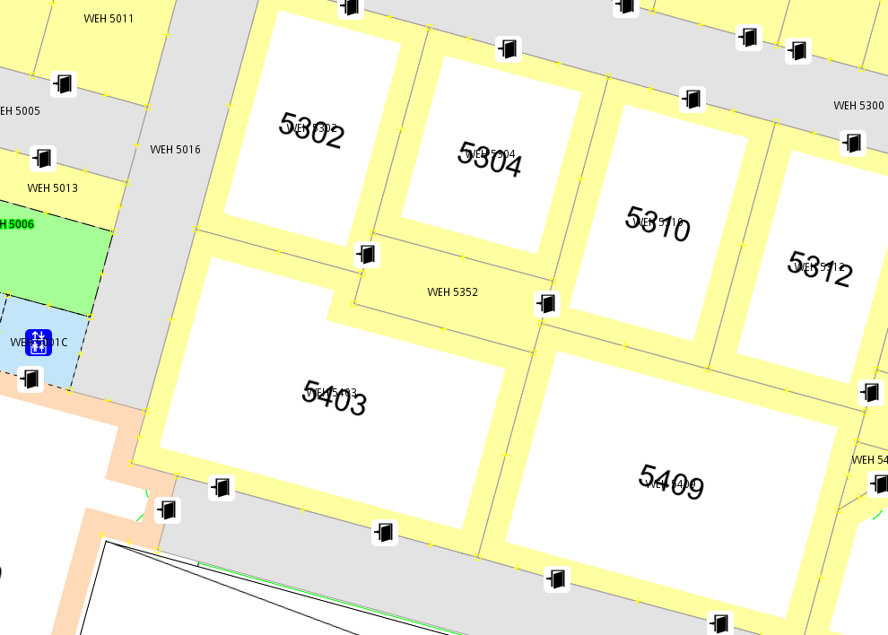

# Mapping

## Basics

Please read the following sections from this [guide](https://labs.mapbox.com/mapping/mapping-with-josm/#creating-data):

- Creating data
- Modifying data
- Tagging

:::note

For our purposes, we are almost always going to use closed ways.

:::

[Keyboard shortcuts](https://josm.openstreetmap.de/wiki/Shortcuts) are going to speed up your mapping significantly. Here are some you should know:

| Shortcut | Action                                             |
| :------: | :------------------------------------------------- |
|   `A`    | Standard draw mode, press again for angle snapping |
|   `S`    | Select tool                                        |
|   `Q`    | Orthogonalize angles                               |

## Indoor Mapping Guidelines

Make sure you've cloned the map data [repo](./getting-started#map-data) to your local machine.

Create a new branch called `andrew_id/building-floor`

- For example, if I were mapping Gates 5, my branch would be `jlyao/ghc-5`

:::note

We are using building abbreviations for everything, you can find a list [here](https://www.cmu.edu/hub/legend.html)

:::

### Set up floor plan

If you are starting a new floor, please ask Preethi or Jason to set up the floor plan file. If you wish to do it yourself, see the floor plans [page](./floor-plans) (**_CURRENTLY INCOMPLETE_**).

### Starting Mapping

1. Open JOSM
2. Press `Ctrl + O` or go to `File > Open` and open the `cmu.osm` file in the root of the map data repo.
3. Click on `Imagery > New picture layer from file...`
   - This option may be under `Imagery > More...`
4. Open the `.png` floor plan file set up in the previous section.
5. Press `Ctrl + N` or click `File > New Layer`. Save the new layer as `BUILDING-FLOOR#.osm`
   - For example, `GHC-5.osm`
6. Make sure the new layer is activated. If not, click where the green checkmark should be to activate it. 
7. Insert a new level using the Indoor Mapping Helper
   - Make sure the panel is open (click this icon  on the left if it's not )
   - Click on the `Insert level` button

8. Enter in the floor number. You are now in drawing mode.
9. Map a simple room or corridor, then press `SPACE`. This will add a new level.
10. Make sure the new level is selected in the top-left  and `Working level` shows the correct level.

11. Under `Object`, select the correct option for what you mapped. Here are a few common ones:

|     Object     | Description                                                                                 |
| :------------: | :------------------------------------------------------------------------------------------ |
|     `ROOM`     | Any office, classroom, or lecture hall. Typically surrounded by walls with doors for access |
|   `CORRIDOR`   | Hallways & other indoor pathways                                                            |
|     `AREA`     | Large indoor areas                                                                          |
|    `STEPS`     | Use this for stairs                                                                         |
| `DOOR_PRIVATE` | Typically classroom and office doors, anything that requires an ID                          |

12. Naming conventions

|     Tag     | Format                           |
| :---------: | :------------------------------- |
|   `Name`    | `BUILDING ROOM#` (e.g. GHC 5207) |
| `Reference` | `ROOM#` (e.g. 5207)              |

:::note

For corridors and areas, they are usually marked on the floor plans with some number, just use that in place of `ROOM#`

:::

13. Typically map corridors first. Break them up by number (e.g. WEH 5100 separate from WEH 5200). Then map rooms and areas, then doors.
14. When mapping new rooms/corridors, if there are overlaps between potential nodes, make sure to use the same node (e.g. adjacent rooms share 2 nodes as corners). Start new nodes on preexisting ways if what you are mapping share common walls/boundaries.

15. Try to keep angles at 90 degrees by using the angle snap tool (press `A` when drawing to toggle) and the orthogonalize tool (press `Q` after selecting ways)

:::tip

Open any one of the existing `.osm` for examples on how your maps should look like.

:::

## Useful Resources

- [Simple Indoor Tagging](https://wiki.openstreetmap.org/wiki/Simple_Indoor_Tagging)
- [Pedestrian navigation - Ways](https://wiki.openstreetmap.org/wiki/Guidelines_for_pedestrian_navigation#Ways_inside_buildings)
- [Pedestrian navigation - Areas](https://wiki.openstreetmap.org/wiki/Guidelines_for_pedestrian_navigation#Inside_buildings)
- [IndoorHelper](https://wiki.openstreetmap.org/wiki/JOSM/Plugins/indoorhelper)
- [PicLayer](https://wiki.openstreetmap.org/wiki/JOSM/Plugins/PicLayer)
